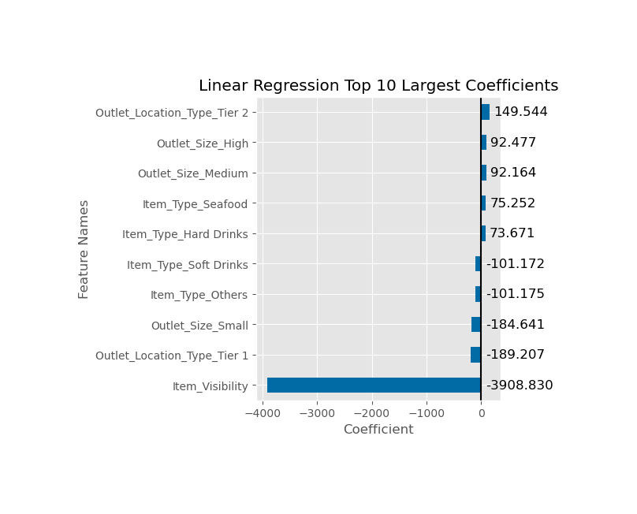
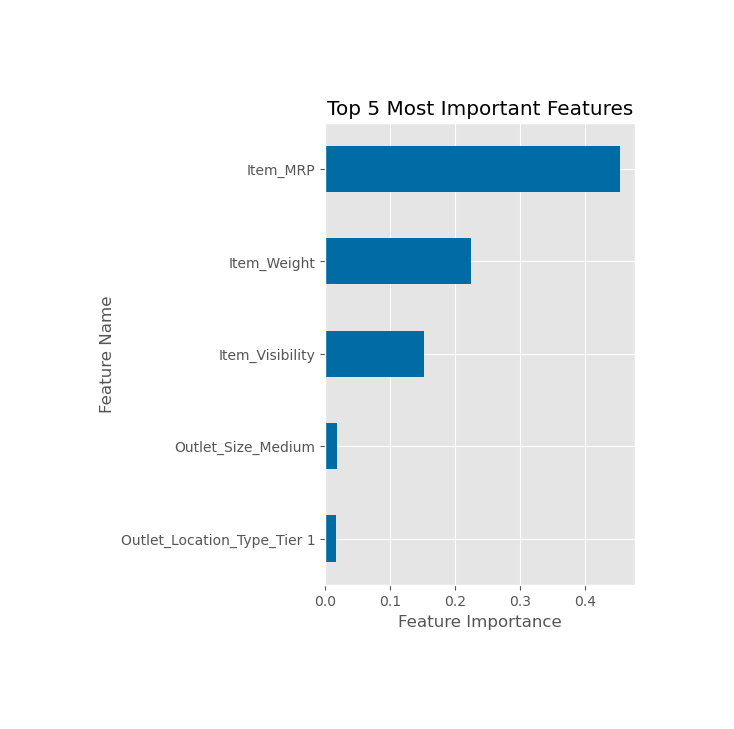

# Project 1 Revisited: Importances and Coefficients Core

## Linear Regression Coefficients

### Interpreting Linear Model's Coefficients

#### Intercept:
* Our model assumed a baseline food item sales of $221.45.
   
#### Coefficients that Positively Influence Food Item Sales:

* Outlet Location Type Tier 2
   * A Tier 2 outlet increases sales by $149.54 .

* Outlet Size High
   * A High (Large) Outlet Size increases sales by $92.48.
   
* Outlet Size Medium
   * A Medium Outlet Size increases sales by $92.16.
   
#### Coefficients that Negatively Influence Food Item Sales:  

* Outlet Size Small
   * A Small Outlet Size decreases sales by -$184.64.
   
* Outlet Location Type Tier 1
   * A Tier 1 outlet decreases sales by -$189.21.
   
* Item Visibility decreases sales by -$3,908.83.

## Decision Tree Regression Feature Importances

#### The Top 5 Feature Importance for the Decision Tree Regression Model:

* #### Item MRP (Price)
* #### Item Weight
* #### Item Visibility
* #### Medium Outlet Size
* #### Tier 1 Outlets
