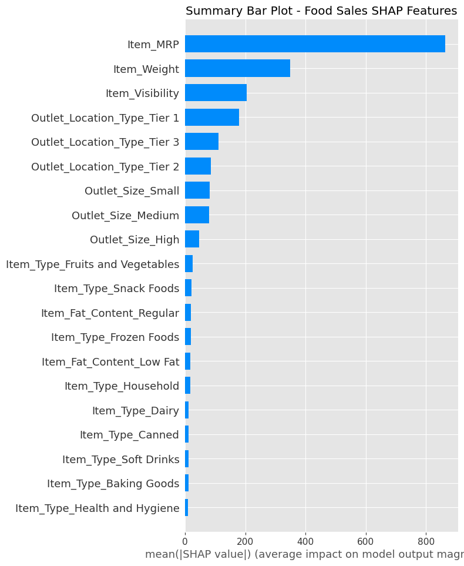
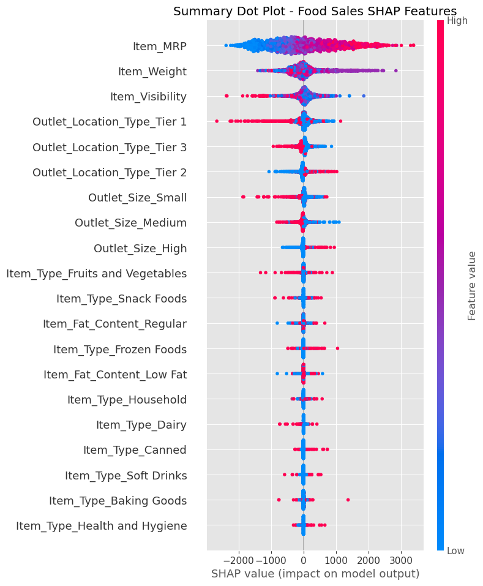

# Project 1 Revisited: Importances and Coefficients Core

## Linear Regression Coefficients

### Interpreting Linear Model's Coefficients

#### Intercept:
* Our model assumed a baseline food item sales of $221.45.
   
#### Coefficients that Positively Influence Food Item Sales:

* Outlet Location Type Tier 2
   * A Tier 2 outlet increases sales by $149.54 .

* Outlet Size High
   * A High (Large) Outlet Size increases sales by $92.48.
   
* Outlet Size Medium
   * A Medium Outlet Size increases sales by $92.16.
   
#### Coefficients that Negatively Influence Food Item Sales:  

* Outlet Size Small
   * A Small Outlet Size decreases sales by -$184.64.
   
* Outlet Location Type Tier 1
   * A Tier 1 outlet decreases sales by -$189.21.
   
* Item Visibility decreases sales by -$3,908.83.

## Decision Tree Regression Feature Importances

#### The Top 5 Feature Importance for the Decision Tree Regression Model:

* #### Item MRP (Price)
* #### Item Weight
* #### Item Visibility
* #### Medium Outlet Size
* #### Tier 1 Outlets

## Food Item Sales : SHAP Summary Bar Plot

### Are they the same features in both? If not, what's different?

#### Top 5 SHAP Features
* Item Price
* Item Weight
* Item Visibility
* Outlet Type : Tier 1
* Outlet Type : Tier 3

#### Top 5 Feature Importances
* Item Price
* Item Weight
* Item Visibility
* Outlet Size : Medium
* Outlet Type : Tier 1

The Top 3 SHAP features, Item Price, Item Weight, and Item Visibility are the same as the original top 3 Feature Importances.

One difference is Tier 1 Outlet is fourth in SHAP Features versus Medium Outlet Size.

Another different is Tier 3 rounds out the top 5 for SHAP features, and Tier 1 Outlets come in fifth for the original Feature Importances.

## Food Item Sales : SHAP Summary Dot Plot

### Top 3 SHAP Features

* #### Item MRP (Price)

   - The higher the price results in greater food item sales.
   
* #### Item Weight

   - There is no correlation between Item Price and food item sales.
   
* #### Item Visibility

   - Less visible items decrease food item sales.
